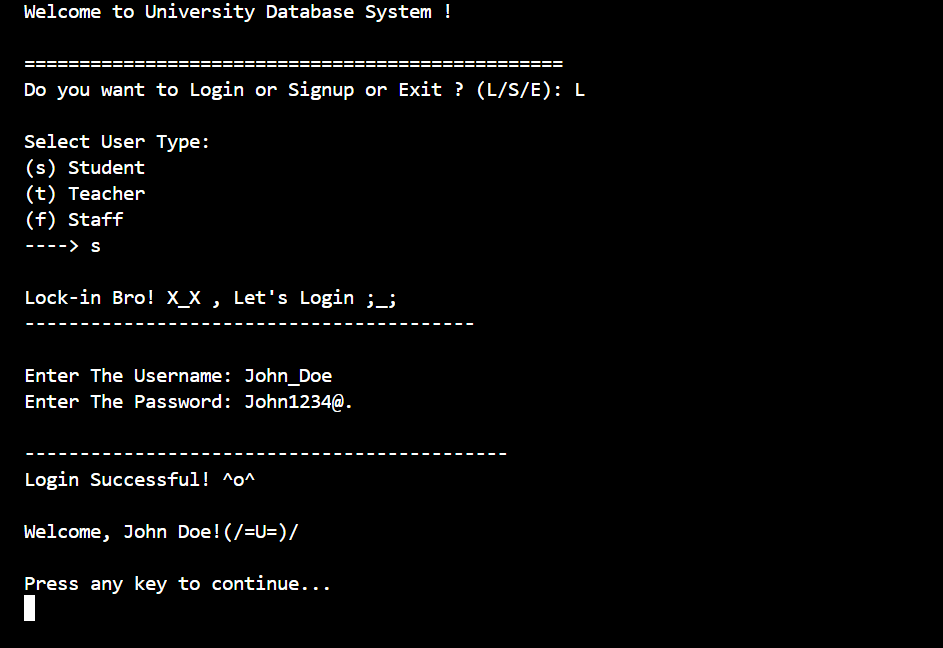
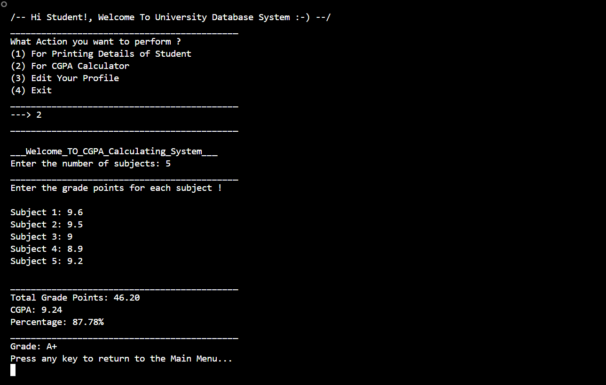

# 🎓 University Database System (v1.0)

A simple yet functional University Database Management System (DBMS) built using the C programming language. This project demonstrates core DBMS features like multi-role login/signup, profile editing, CGPA calculation, and modular menus — all without external libraries or databases.

---

## 🚀 Features

- 🔐 **Multi-user login system**:
  - 👨‍🎓 Student  
  - 👩‍🏫 Teacher  
  - 👨‍💼 Staff

- ✏️ Edit Profile with input validation and persistent save
- 📚 CGPA Calculator (includes percentage conversion)
- 📁 User data stored via file handling (local `.txt` files)
- 💬 Interactive console interface with playful prompts
- 🧠 Modular structure based on user roles
- ✅ `system("cls/clear")` for clean cross-platform UI

---

## 🖼️ Demo Screenshots

### 👤 User Login and Menu Interface


### 📟 Student Menu Preview


---

## 🛠️ Technologies Used

- **Language**: C (Standard)
- **Compiler**: GCC
- **IDE**: VS Code
- **Version Control**: Git & GitHub
- **Storage**: Local text file simulation (no external DB)

---

## 🧑‍💻 How to Run

```bash
# 1. Clone the repository
git clone https://github.com/Maysoftwareeng987/University-Database-System.git

# 2. Navigate into the project directory
cd University-Database-System

# 3. Compile the code
gcc Databasesystem.c -o UniversityDb.exe

# 4. Run the program
./UniversityDb.exe
```

---

## 🔒 Current Version: `v1.0 (Stable)`

- ✅ Multi-role login system  
- ✅ CGPA Calculator  
- ✅ Profile Editing System  
- ✅ Modular menus per user type  

---

## 🔧 Planned Features for `v1.1`

- ❌ Delete User functionality  
- 📅 Attendance logging with date stamps  
- 🛡️ Admin control panel  

---

## 👤 Author

Made with logic + passion by **Mayank Koli**  
🔗 GitHub: [@Maysoftwareeng987](https://github.com/Maysoftwareeng987)

---

## ⚠️ Disclaimer

> This project is for learning and demonstration purposes only.  
> All user data is stored as plain text without encryption.
